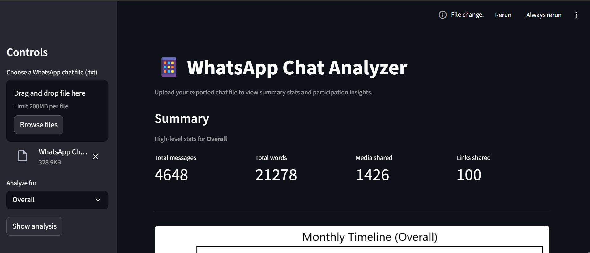
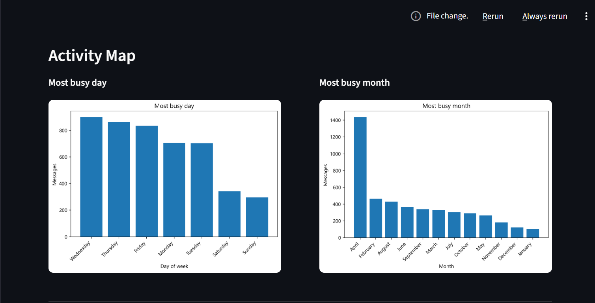

# 💬 WhatsApp Chat Analyzer (NLP & Streamlit)  

## 🛠 Tech Stack & Tools

<p align="center">
  <a href="https://www.python.org/">
    
  </a>
  <a href="https://en.wikipedia.org/wiki/Natural_language_processing">
    
  </a>
  <a href="https://streamlit.io/">
    
  </a>
  <a href="https://matplotlib.org/">
    
  </a>
</p>

---

## 📌 Project Overview  
This **NLP-powered interactive Streamlit app** analyzes WhatsApp chat exports to uncover **conversation trends, word usage, emoji insights, and activity heatmaps**.  
It transforms raw text files into **data-driven visualizations** for exploring engagement patterns and user behavior.  

**Key Features:**  
1. **Summary Stats** – Messages, words, media, and links shared.  
2. **Timelines** – Monthly & daily chat activity trends.  
3. **User Contribution** – Most active users and participation share.  
4. **Activity Maps** – Busiest days, months, and weekly heatmap.  
5. **Word Cloud & NLP** – Frequent terms and language usage.  
6. **Emoji Analysis** – Top emojis with counts and visual charts.  

---

## 📊 Screenshots  

### 1️⃣ Summary & Timelines  
  

### 2️⃣ Activity Map
  

---
## 🔑 Insights Delivered  
- ✅ Identified **most active users** and their contribution to chats.  
- ✅ Highlighted **peak chat days, months, and hours** via activity maps.  
- ✅ Extracted **most common words** using NLP preprocessing.  
- ✅ Generated **emoji usage breakdown** for richer interaction analysis.  
- ✅ Visualized **timelines of conversation growth**.  

---

## 🛠 Tech Stack & Tools  
- **Python (3.8+)** 
- **Streamlit**  
- **Pandas & NumPy** 
- **Matplotlib** 
- **WordCloud** 
- **emoji**  
- **Custom Modules** – `preprocessor.py` & `helper.py` for text cleaning & analysis  

---

## 📂 Project Workflow  
1. **Data Input** – Upload exported WhatsApp `.txt` chat file  
2. **Preprocessing** – Clean system messages, remove stopwords/media/deleted entries  
3. **Feature Extraction** – Derive users, words, links, emojis, timelines  
4. **NLP Processing** – Tokenization, stopword filtering, word cloud generation  
5. **Visualization** – Generate charts, activity heatmaps, and emoji barplots  
6. **Interactive Exploration** – Analyze chats overall or per user via Streamlit controls  

## 🚀 How to Run  
```bash
# Clone the repository
git clone https://github.com/your-username/WhatsApp-Chat-Analyzer.git  
cd WhatsApp-Chat-Analyzer  

# Install dependencies
pip install -r requirements.txt

# Run the Streamlit app
streamlit run app.py  
